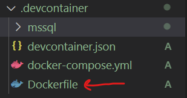
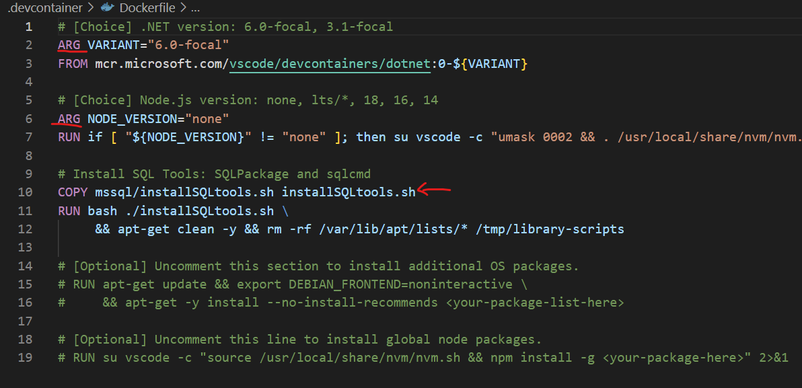
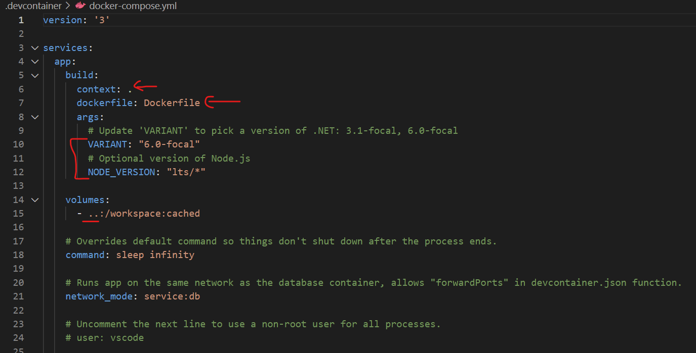
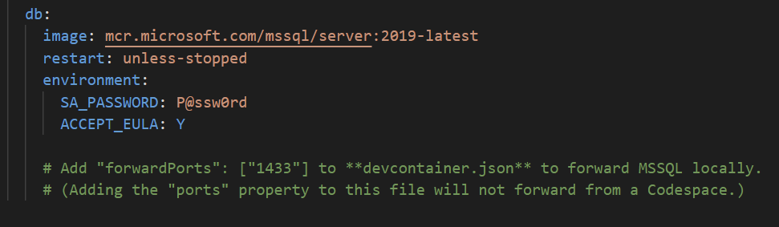
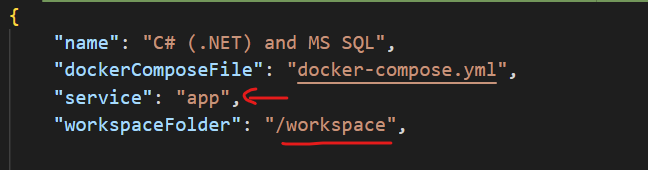
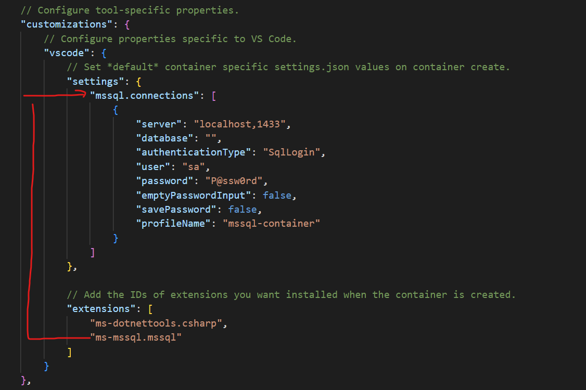
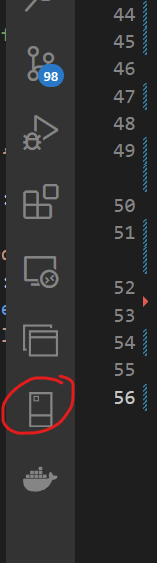
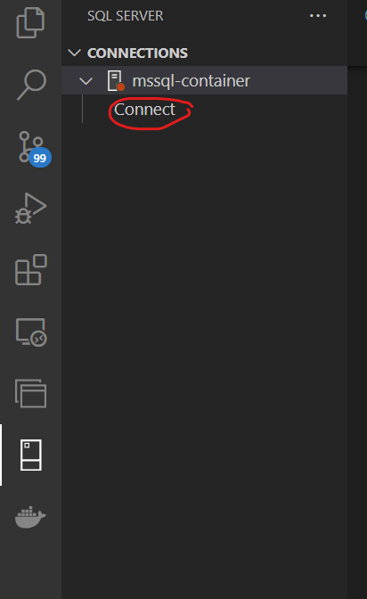
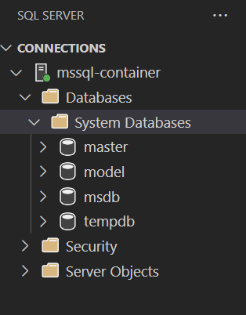

# practical-docker

Now that we're in our container there are couple of things to note.
Firstly you may get a notification about a build issue. This occurs if you build a .net project in Windows then mount the directory in Linux.
To rectify it simply delete your `bin` and `obj` folders.

If you open a terminal window you'll see we're now in Linux so our terminal is bash. Note that we have oh my zsh installed too.
If you have your own dotfiles repository, hold that thought for a few minutes.

You'll see that we have a new folder in our project called `.devcontainer`, within that are a few files so let's look at the Dockerfile first

This is just a standard Dockerfile, though you can see that it takes a couple of arguments and copies a file from the mssql directory to the image. 

Let's now look at the docker-compose file

Docker-Compose is a way to easily orchestrate multiple containers and have them networked together. This compose file creates two images.

Firstly we have a service called `app` which defines our development container. The context given to it is . which means any copy commands in the Dockerfile are relative to the this (.devcontainer) directory. 

Under this you can see the args that we pass thorugh to the Dockerfile, and that we mount ../ (i.e. project root directory) to a directory called `workspace` within the container.

The final thing to note for app is that under `network_mode` we link to `service:db`. What is this?

Look at the next service that gets defined in the docker-compose file and you'll see that it's called db

The important information here is that instead of building this from a dockerfile like we did for app, we're pulling the MS-SQL server image down.

For its environment notice that we have set the SA_PASSWORD to `P@ssw0rd`

Let's now look at the devcontainer.json file, which tells VSCode how to construct the container for us

Firstly notice that we're specifying a docker-compose file and `app` as the service to connect to and that VSCode should mount `/workspace` as the working folder. Remember that in the docker-compose file the root of the code directory was mounted to `/workspace`.

It's worth pointing out here that you can just mount a simple docker file if you don't have any dependencies.

Next comes the exciting part

The customizations part is useful to declare a common set of extensions and settings for use within the contianer.

Got a team that's still arguing on Tabs vs Spaces? Set the value to spaces in the settings file and let the tab folks wallow in thier own life choices.

Want to reduce the number of `spelling` comments in PRs? Add a spell check extension here AND configure a list of known words based on the working domain

I've highlighted in the image how there is a settings section for `mssql.connections` and an extension added called `ms-mssql.mssql`

If you look to the left toolbar in VSCode you should see the MSSQL server extenion installed, so give it a click

From here choose Connect from the mssql-container link, and enter the passwrod from the compose file `P@ssw0rd`

If you expand the list of databases you should see a couple of standard ones but no `contoso` one

Let's get our application configured to talk to our containerized database.

execute `git checkout v3`