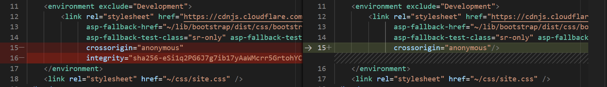
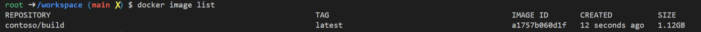
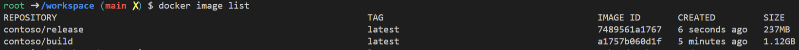
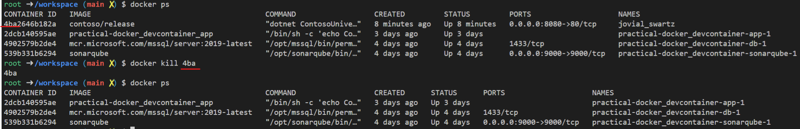

# practical-docker

> Before we get started we need to make a modification to the code. In the `Views/Shared/_Layout.cshtml` file delete the SHA integrity check on bootstrap (or update it - your choice)


The final thing we'll do is to build our project using a docker image.
Traditionally dedicated build machines are used to create final builds and these require specific setups in order to run. Whilst having an image is useful it makes the build process opaque to the developers. 
With ADO, Gitlab and Github offering pipelines it's become a lot easier to produce builds. However, having gone through 3 changes of build pipelines for a single project, I can tell you how glad I was that we didn't buy into `ease of use` and instead opted for a transparent build process that anyone could run.

>Note: Dockerfiles take arguments and it's important to leverage these heavily for security. As an example a certificate used for signing *should* be declared in a safe place that developers don't have access to. Likewise any deployment or pushing of containers should be authorized by a security token passed in to prevent misuse.

We have a Dockerfile for our dev container, so let's now creating for building our application

In the root of the project create a file called `Dockerfile`

We're going to use the [dotnet SDK](https://hub.docker.com/_/microsoft-dotnet-sdk/) image to build our project BUT we don't want that to be the base image for our application because it has a lot of `bloat` in it. We want our container images to be as small as possible so that we can pack as many as we can onto a single host machine.

```
FROM mcr.microsoft.com/dotnet/sdk:6.0 AS build
WORKDIR /source
```

Note the `AS build` statement which labels this particular step. The `WORKDIR` statement just tells docker the default directory in the build container that we want to use. It'll create it for you so name it whatever feels appropriate.

Docker works by caching the result of each statement in a dockerfile. If you've ever seen dozens of statements joined by a ` \`, that's why. It's to optimize the building of your image. 

For projects that use packages such as NPM and Nuget the best way to optimize is to copy over the sln, csproj and package.json files over first, and then run a restore operation. The reason being that these operations occur over the network (no disk caching on these images) and take time. In addition the code is much more likely to change than the package list so we want to cache what we can as early as we can.

We don't have sln file here, but we can copy across our csproj file
```
COPY *.csproj .
```
Next we need to download any packages we're using so
```
RUN dotnet restore
```
If you had a package.json file too you'd have to make a call as to whether you want to copy both definition files THEN run a package fetch or if you want to copy one, run fetch, copy the other, run fetch. In my experience package.json changes a lot more than csproj (and don't forget your package lock file!)

At this point we've got all the packages we need, so now we can just copy over the files, any existing files won't be impacted so it's easiest to just copy everything
```
COPY . .
```
One caveat to point out here is that when we run this Dockerfile, we'll be running it from our project root. Docker will effectively pass the entire directory to the docker process which can take a long time. If we've done any debugging, sonarqube runs etc. then there will be artifacts generated that we probably don't need to be passed in. To help us out here, we can create a docker ignore file which tell Docker what it shouldn't copy - just like a gitignore file.

Create a file at the root (it should always be next to the Dockerfile) call `.dockerignore`
and put this in it
```
bin
obj
.sonarqube
```
Just like a gitignore file it supports globs, so go to town with whatever you want to ignore

Back to our dockerfile we're now ready to go to the next step. For us it's pretty simple as we'll just enter
```
RUN dotnet publish -c release -o /app --no-restore
```
If you're not up on your dotnet commands it'll simply create a publishable website and it won't try to get the packages again (--no-restore). The output will be written to a directory called `app`.

Normally this is where you'd run unit tests, linting, sonarqube and anything else that's required to ensure that the build output is going to be worth it.

---

Now that our application is built we need to move it over to one of those tiny containers that we talked about earlier. Instead of using the SDK for our image, we'll use the [runtime only](https://hub.docker.com/_/microsoft-dotnet-aspnet/)

```
# create our production image
FROM mcr.microsoft.com/dotnet/aspnet:6.0 as final
WORKDIR /app
```

Nothing new here except that we're using a directory called `app` instead of `source`. You can call it whatever but the canonical name is `app`

How do we get the compiled application over from the build image to the runtime image though? Well it's very similar to the copy command we've already used

```
COPY --from=build /app ./
```
Notice how we pass the argument `--from=builder`. If you named your build step to something else, then you'll need to rename it here too.

Since we're running a website we should also let Docker know that it should listen on a port for requests. We can use the `EXPOSE` command to do this
```
EXPOSE 80/tcp
```

Finally we need to tell the image what to do when it starts up
```
ENTRYPOINT ["dotnet", "ContosoUniversity.dll"]
```
Here it's simply a case of calling dotnet and passing in the startup dll argument

>Note: There are two forms of kicking off a docker container `ENTRYPOINT` and `CMD`. CMD is used when you want to be able to override the way a container starts. ENTRYPOINT is when an image has a specific purpose such as running a website. You can use the two in concert such as 
```
ENTRYPOINT ["echo", "Hello"]
CMD ["World"]
```
>When this is run via `docker run image` it'll write out `Hello World` but running with `docker run image foobar` will result in `Hello foobar`

Our dockerfile is complete and should look like this now:
```
FROM mcr.microsoft.com/dotnet/sdk:6.0 AS build
WORKDIR /source

COPY *.csproj .
RUN dotnet restore

COPY . .
RUN dotnet publish -c release -o /app --no-restore


# create our production image
FROM mcr.microsoft.com/dotnet/aspnet:6.0 as final
WORKDIR /app
COPY --from=build /app ./
EXPOSE 80/tcp
ENTRYPOINT ["dotnet", "ContosoUniversity.dll"]
```

The final step is to create some scripts to help us with our pipeline

Firstly we need to be able to build our application. Because we named our steps (builder, final) we can tell docker to run up to and including a specific step. Create file called `createBuildImage.sh` and then in a terminal type `chmod +x ./createBuildImage.sh`. The contents should look like this:
```
#!/usr/bin/env bash
docker build --target build -t contoso/build .
```
Here we're tagging out image as contoso/build so we'll know what to look for. Once you saved it, run it from the command line!
After it has completed run `docker images list` and you should see something like this:

Look at the whopping size of that build image!!

Let's create another bash file called `createReleaseImage.sh` and again run `chmod +x ./createReleaseImage.sh`

The contents of this file should be 
```
#!/usr/bin/env bash
docker build -t contoso/release .
```

Running `docker images list` again will show what a difference the SDK and Runtime image makes:


Finally we want to run our image (note that it won't work as we don't have a database). From your host machine type

```
docker run -d -p 8080:80 contoso/release
```
The `-d` means run as detached. You don't have to do this, and if you don't your terminal will connect to the container and you'll see std out statements

`-p 8080:80` means map port 8080 on the host machine to port 80 on the container

`contoso/release` isn't tagged so docker will run whichever image is auto tagged as latest. This will make a bit more sense later on with Kubernetes (K8s)

If you're curious `how` we'd connect to a SQL server instance, well we should configure the app to use Environment variables as overrides to the default application config. We could then pass a connection string into our docker run command as an argument. To be honest though this is something we'll cover in the K8s workshop.

Now that we're all done with our image we can dispose of it by getting its container ID via `docker ps`.
Once we have the container ID we only need to type enough of it so that there is no ambiguity in which container we want removed (typically the first 3 chars).


Thanks for running through to the end. I hope this was useful, please send me any feedback to make this better.