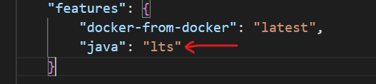
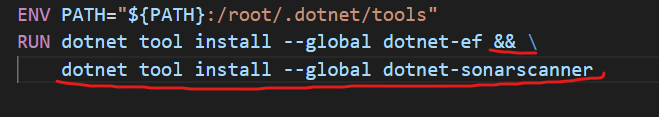
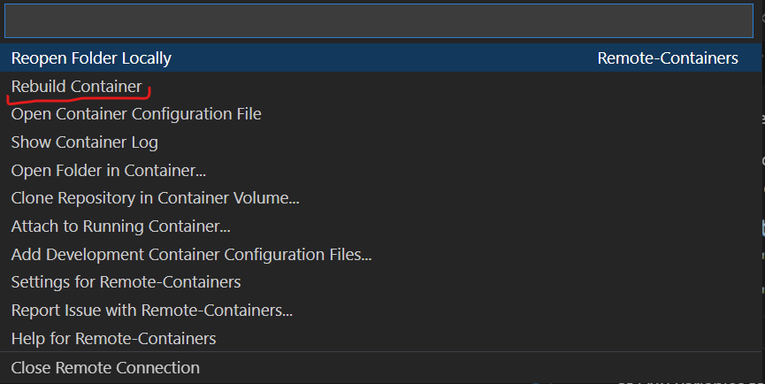

# practical-docker

Now that we have a working website we should setup some code analysis to ensure that we keep the quality of our code high. 

Sonarqube is a freemium service that can take care of this for us. In order to get it integrated we'll need to make a couple of changes to our container files.

First let's head to the `docker-compose.yml` file under `.devcontainer` and add this section to the bottom"
```
  sonarqube:
    image: sonarqube
    ports:
      - "9000:9000"
```
This simply adds a container for Sonarqube and maps port 9000 (sonarqube default) on the container to 9000 on the host.

Docker compose uses the service name as a resolvable address, so we can save some time by adding in a couple of environmental variables here too:
```
    environment:
      - SONARQUBE_PROJECT_KEY=Contoso
      - SONARQUBE_URL=http://sonarqube:9000
      - SONARQUBE_TOKEN=YWRtaW46YWRtaW4x
```
These can go after the `network_mode` declaration in our `app` service, and we'll use them a bit later.

Mapping the port in the compose file isn't enough for VSCode however, and in the `devcontainer.json` file we need to tell it to forward the port too. After the `customization` section add this:
```
"forwardPorts": [9000],
```
This will enable us to browse the sonarqube website from our host machine rather than it only be accessible within the container.

That's all that's needed to throw another container in and hook it up. You can imagine how easy it is to build up a suite of supporting services like Redis and HashiCorp Vault.

For performing a sonarqube analysis on our tool though we do need to add a couple of extras. Firstly it needs Java (🤮) to run, so we need to add this to our `devcontainer.json` too:



We could bake Java to our Dockerfile but this is an easier way as Java needs quite the set of ENV variables to work properly.

Whilst we're here we'll add some environment variables that'll help us out later.


Secondly we need to add a dotnet tool to start the analysis, so in our Dockerfile let's throw this in at the bottom:


When this is all done, click on the `dev container` box in the lower left of VSCode and choose `rebuild container` from the command palette


---
We now have support for Sonarqube so the final step is to use it when we do our builds.
At the root of the project create a new file called `buildAndAnalyse.sh`, and because it's bash we need to set the execute permission on the file. Bring up the terminal in VSCode and type `chmod +x ./buildAndAnalyse.sh`

Now open up the file and paste in the following:
```
#!/usr/bin/env bash

sonarqube_generate_token() {
    curl --silent \
         --location \
         --request POST "${SONARQUBE_URL}/api/user_tokens/generate?name=build" \
         --header "Authorization: Basic ${SONARQUBE_TOKEN}" | jq -r .token
}

sonarqube_revoke_token() {
    curl --silent \
         --location \
         --request POST "${SONARQUBE_URL}/api/user_tokens/revoke?name=build" \
         --header "Authorization: Basic ${SONARQUBE_TOKEN}"
}

main() {
    sonarqube_revoke_token
    BUILD_TOKEN=$(sonarqube_generate_token)
    dotnet sonarscanner begin \
        /k:$SONARQUBE_PROJECT_KEY \
        /d:sonar.host.url=$SONARQUBE_URL \
        /d:sonar.login=$BUILD_TOKEN \
        /d:sonar.exclusions=**/wwwroot/**/*

    dotnet build

    dotnet sonarscanner end \
        /d:sonar.login=$BUILD_TOKEN
    sonarqube_revoke_token
    exit 0
}
main $@
```

You may remember that when we setup the environment variables the `SONARQUBE_TOKEN` one looked like this `YWRtaW46YWRtaW4x`. This is simply base 64 encoded and we can find out what it's actual values are by running this command in the terminal:
```
echo -n "YWRtaW46YWRtaW4x" | base64 -d
```

This should give you the result `admin:admin1`. From you windows environment open a browser window and go to localhost:9000. You should see the sonarqube login page where you can enter `admin` for both the username and password. It'll then ask you to change it, at which point you should set the password to be `admin1` to match our encoded value.

>Note: This is a bit flakey here, as the whole point of containerizing our dev environment is to keep things consistent. This seems to be a newer change to Sonarqube and hopefully there is a way to set the admin password via ENV variables in the docker compose file

The final step here is to run the analysis on our solution. From the terminal simply type `./buildAndAnalyse.sh` and hit enter.

>Note: This part can be painfully slow when the source code is mounted from a Windows volume. If you intend to use dev containers in the future with Sonarqube, you can get much better performance by cloning the repository into a directory on your Windows Subsystem for Linux (WSL) drive.

When the analysis is complete, reload the sonarqube page in your browser and have a look at what it picked up!

execute `git checkout v5`