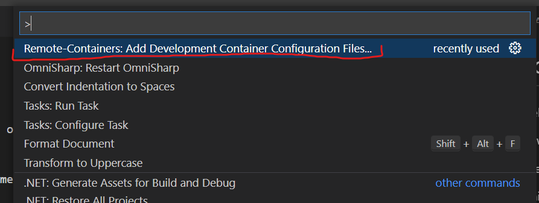
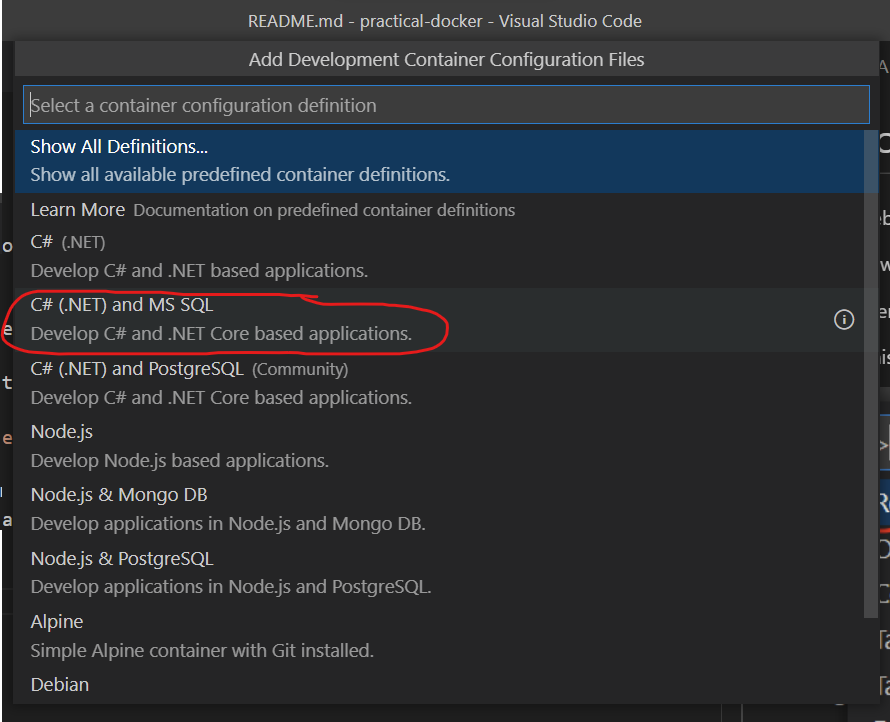
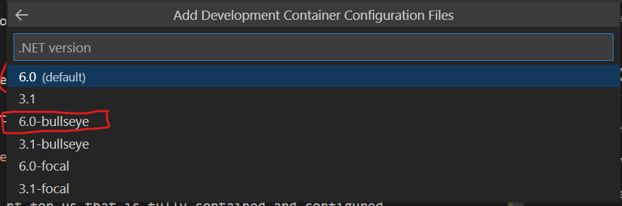
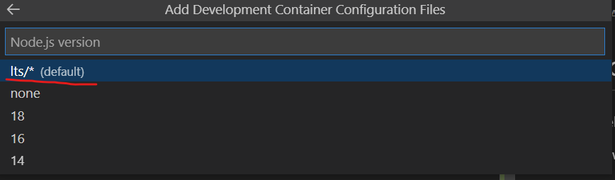
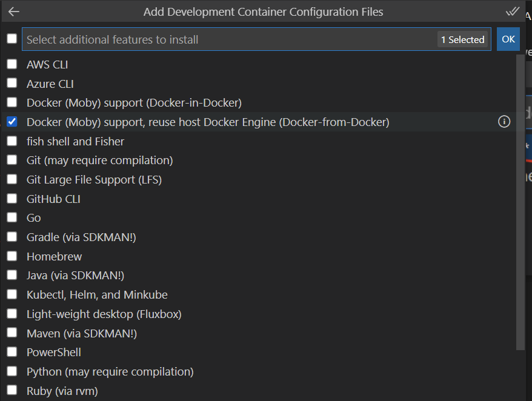
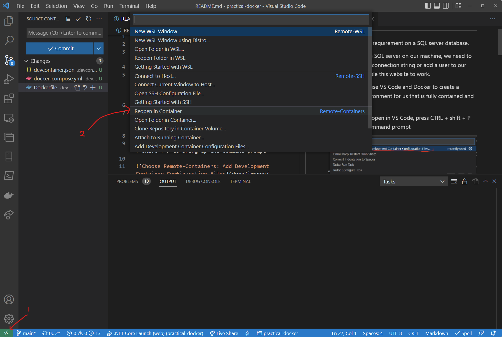

# practical-docker

This website has a requirement on a SQL server database.

Even if we do have SQL server on our machine, we need to either change our connection string or add a user to our SQL server to enable this website to work.

However, we can use VS Code and Docker to create a development environment for us that is fully contained and configured.

With this solution open in VS Code, press CTRL + shift + P to bring up the command prompt

and select the Remote-Containers option shown in the diagram
(Note: If you don't see this option you need to install the remote-containers VSCode extension)

Since SQL Server can run on Linux we can choose the C# and MS SQL option

Now we need to choose our base container image, so choose .NET 6 on Debian bullseye

Since we have a website with CSS and Javascript we should probably include Node, so choose lts here

Now we can choose any extra bits that we may want in out dev container. The most interesting thing here is that we can even install Docker! Our choices are to either have Docker running inside our container (Docker-in-Docker) or use the existing Docker engine from our host machine (Docker-from-Docker). For now let's select `Docker-From-Docker`

And when prompted just choose the latest Docker version.

This will create some container files for you. In order to open our dev container, click on the little green arrows in the lower left of VSCode and then choose Reopen in Container

now execute `git checkout v2` in your terminal