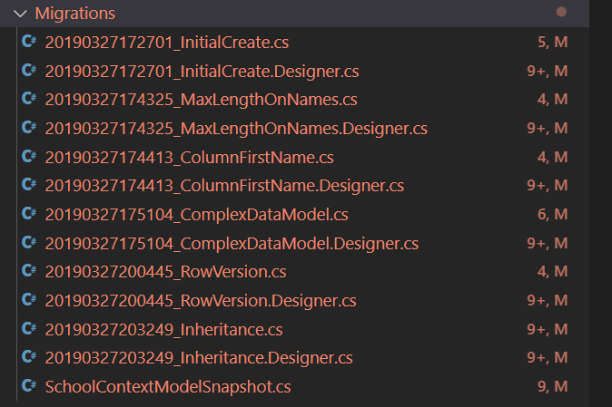
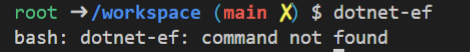
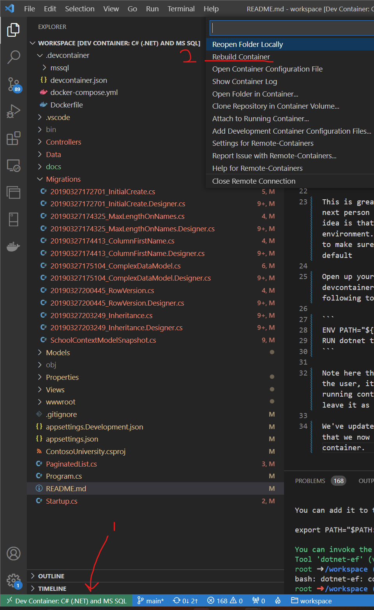
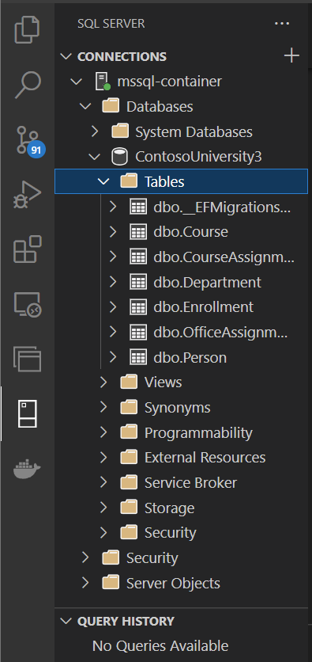
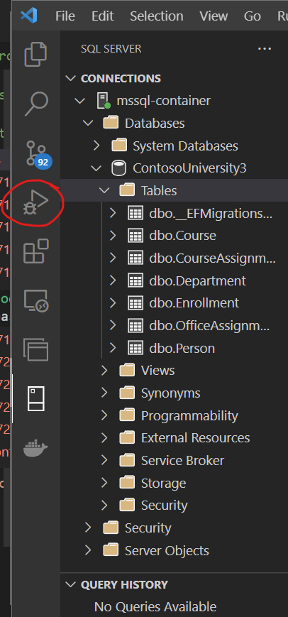
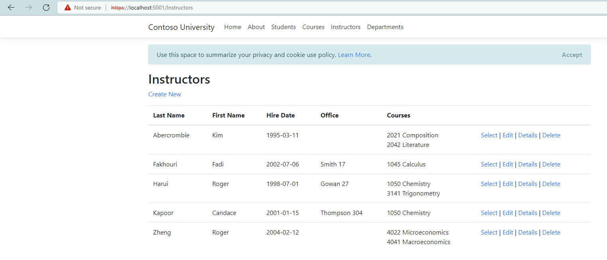

# practical-docker

This project uses Entity Framework (EF) to connect to the database and generate models. If we look in the Migrations folder we can see that a number of migrations have been created already for this project


In order to use EF we need to:
1. configure the data connection string
2. apply a migration to the database

If we look in appsettings.json we can see that there is a connection string already, and it just so happens that this connection string will connect to our database. We can be sure of that because localhost worked out fine for our MSSQL extension we looked at earlier

Let's check to see if EF tooling is installed by opening up a terminal and typing `dotnet-ef`

You should get a failure like this:


We can rectify that by typing `dotnet tool install --global dotnet-ef` and then running `dotnet-ef` again right?.....


Turns out that we need to add the .net tools directory to our path.
`export PATH="$PATH:/root/.dotnet/tools"`

This is great for us, but what about the next person who uses this container? The idea is that we have a consistent dev environment. So let's edit our Dockerfile to make sure everyone gets this tool by default

Open up your Dockerfile under the .devcontainer directory and add the following to the bottom

```
ENV PATH="${PATH}:/root/.dotnet/tools"
RUN dotnet tool install --global dotnet-ef
```

Note here that we're specifying `root` as the user, it's not the best practice to go running containers as root, but we'll leave it as is for our dev container.

We've updated our Dockerfile which means that we now need to rebuild our dev container. 



You can do this either via the command pallete (ctrl + shift + p), or by clicking on the green Dev Container banner in the lower left, then selecing rebuild container.

Once the container is rebuilt you should be able to execute the comment
`dotnet-ef database update` in the terminal.

Once complete you should now see the database `ContosoUniversity3` present in the MSSQL exteions.


By clicking on the debug icon on the left hand toolbar, you should now be able to successfully run the application from a Linux container





execute `git checkout v4`